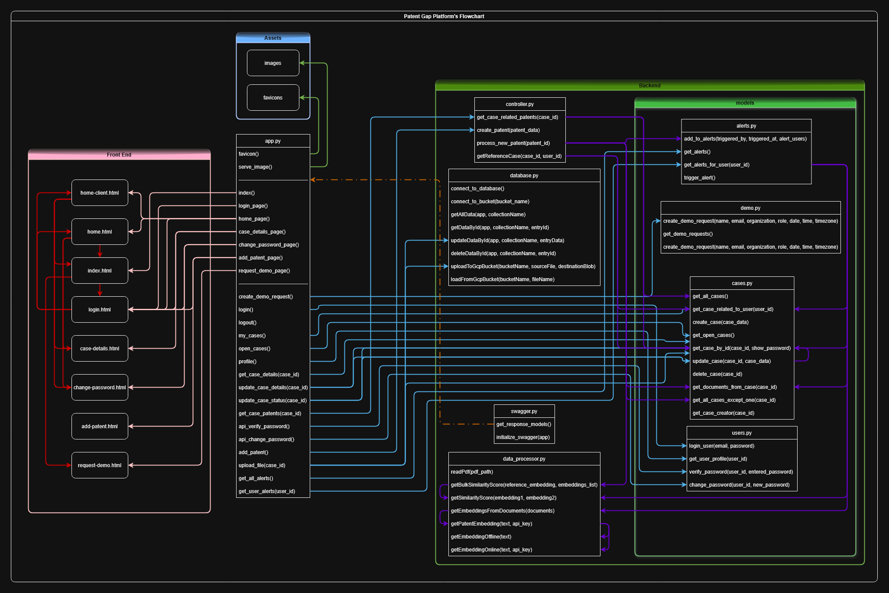
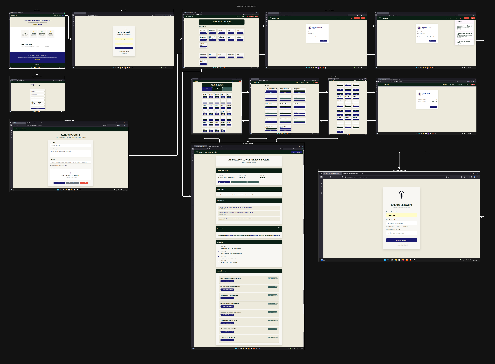

# Patent Gap - Flask Backend with HTML Frontend

A Flask-based web application for patent management with a modern HTML frontend.

## 📖 Document Navigation

This README uses emoji badges to help you quickly identify different types of content:

- **👥 For Users** - User-facing features, guides, and credentials
- **🔧 Setup & Configuration** - Installation, setup, and running instructions
- **⚙️ Technical/Developer** - Technical documentation, architecture, API details, and development notes
- **🚀 Future Enhancements** - Planned features and improvements

---

## ⚙️ Project Structure

```
patent-gap/
├── Backend/                 # Python backend files
│   ├── app.py              # Main Flask application
│   ├── controller.py       # Business logic controllers
│   ├── data_processor.py  # PDF processing and text embedding functions
│   ├── database.py         # Database and cloud storage connectivity (Firebase, GCP)
│   ├── swagger.py          # Swagger/OpenAPI configuration
│   ├── models/             # Data models organized by domain
│   │   ├── alerts.py       # Alert management models
│   │   ├── cases.py        # Case management models
│   │   ├── demo.py         # Demo request models
│   │   └── users.py        # User management models
│   └── env_example.txt     # Environment variables example
├── Frontend/               # HTML frontend files
│   ├── index.html          # Home page
│   ├── login.html          # Login page
│   ├── home.html           # Attorney dashboard page
│   ├── home-client.html    # Client dashboard page
│   ├── case-details.html   # Case details page
│   ├── add-patent.html     # Add new patent page
│   ├── request-demo.html   # Request demo page
│   ├── change_password.html # Change password page
│   └── styles.css          # Shared CSS styles
├── Assets/                 # Images, media, documents
├── Screenshots/            # Application screenshots
├── requirements.txt        # Python dependencies
└── README.md              # This file
```

## 👥 Flowcharts






## 👥 Features

- **Home Page**: Landing page with three feature cards showcasing the platform's capabilities
- **Login System**: Secure authentication with session management
- **Dual Dashboard System**: 
  - **Attorney Dashboard**: Full case management with statistics and navigation
  - **Client Dashboard**: Simplified view with Active/Closed Patents sections
- **Case Management**: View and manage user's assigned cases with status tracking
- **Patent Management**: 
  - **Add New Patents**: Comprehensive form with file upload capabilities
  - **Patent Tracking**: Monitor active and closed patents
  - **Document Upload**: PDF file upload with drag-and-drop functionality
- **Case Details**: Detailed view of individual cases with related patent information
- **Profile Management**: User profile with case statistics and password management
- **Alert & Notification System**: 
  - Real-time alert notifications for similar patent cases
  - Alert popup panel with case details and similarity scores
  - Navigate directly to related cases from notifications
  - User-specific alerts based on case relationships
- **Demo Requests**: Request personalized demonstrations with scheduling
- **User Roles**: Support for both 'client' and 'attorney' user roles
- **API Documentation**: Interactive Swagger UI for comprehensive API testing and exploration

## 🔧 Setup Instructions

### Quick Installation (Recommended)

The installation scripts will automatically set up a virtual environment, install dependencies, create necessary directories, and generate run scripts.

#### For Linux/macOS:
```bash
# Make the script executable
chmod +x install.sh

# Run the installation script
./install.sh
```

#### For Windows:
```cmd
# Run the batch installation script
install.bat
```

#### For Windows PowerShell:
```powershell
# Set execution policy (if needed)
Set-ExecutionPolicy -ExecutionPolicy RemoteSigned -Scope CurrentUser

# Run the PowerShell installation script
.\install.ps1
```

#### What the Installation Scripts Do:
- ✅ Check Python 3.7+ installation
- ✅ Create virtual environment (`venv/`)
- ✅ Install all dependencies from `requirements.txt`
- ✅ Create necessary directories (`Assets/`, `Backend/logs/`, etc.)
- ✅ Generate `.env` file from template
- ✅ Create convenient run scripts (`run.sh`, `run-dev.sh`, `stop.sh`)
- ✅ Set up proper file permissions

### Manual Installation

If you prefer to set up the environment manually or the installation scripts don't work for your system:

#### 1. Create Virtual Environment

```bash
# Create virtual environment
python3 -m venv venv

# Activate virtual environment
# On Linux/macOS:
source venv/bin/activate
# On Windows:
venv\Scripts\activate
```

#### 2. Install Dependencies

```bash
# Upgrade pip
pip install --upgrade pip

# Install required packages
pip install -r requirements.txt
```

**Dependencies included:**
- `Flask==2.3.3` - Web framework
- `Flask-CORS==4.0.0` - Cross-origin resource sharing
- `python-dotenv==1.0.0` - Environment variable management
- `flasgger==0.9.7.1` - Swagger UI integration for API documentation
- `psycopg2-binary==2.9.7` - PostgreSQL database adapter
- `pymongo==4.5.0` - MongoDB database driver
- `firebase-admin==6.4.0` - Firebase Admin SDK for authentication and cloud services
- `PyPDF2==3.0.1` - PDF file processing
- `openai>=1.0.0` - OpenAI API for text embeddings (requires API key)
- `numpy>=1.24.0` - Numerical computing library
- `scikit-learn>=1.3.0` - Machine learning library for TF-IDF embeddings

#### 3. Environment Configuration

Copy the environment example file and configure your settings:

```bash
# Copy environment template
cp Backend/env_example.txt Backend/.env

# Edit the .env file with your preferred settings
# Default values:
# SECRET_KEY=your-secret-key-change-this-in-production
# PORT=5000
# DEBUG=True
# FLASK_ENV=development
# FIREBASE_CREDENTIALS=path/to/firebase-service-account.json
# FIREBASE_DATABASE_URL=https://your-project.firebaseio.com
# GOOGLE_APPLICATION_CREDENTIALS=path/to/gcp-service-account.json
# OPENAI_API_KEY=sk-your-key-here
```

#### Firebase Setup (Optional)

If you plan to use Firebase for authentication or cloud services:

1. **Create a Firebase project** at [Firebase Console](https://console.firebase.google.com/)
2. **Generate a service account key**:
   - Go to Project Settings → Service Accounts
   - Click "Generate new private key"
   - Download the JSON file
3. **Configure environment variables**:
   ```bash
   # Add to your .env file
   FIREBASE_CREDENTIALS=path/to/your/firebase-service-account.json
   FIREBASE_DATABASE_URL=https://your-project.firebaseio.com
   GOOGLE_APPLICATION_CREDENTIALS=path/to/your/gcp-service-account.json
   ```

#### OpenAI API Setup (Optional - For Text Embeddings)

If you plan to use OpenAI embeddings for patent analysis:

1. **Create an OpenAI account** at [OpenAI Platform](https://platform.openai.com/)
2. **Generate an API key**:
   - Go to [API Keys](https://platform.openai.com/api-keys)
   - Click "Create new secret key"
   - Copy the key (starts with `sk-`)
3. **Configure environment variable**:
   ```bash
   # Add to your .env file
   OPENAI_API_KEY=sk-your-key-here
   ```
4. **Note**: Without an API key, you can still use the offline TF-IDF embedding method (`getEmbeddingOffline`) for patent analysis.

#### 4. Create Necessary Directories

```bash
# Create required directories
mkdir -p Assets
mkdir -p Backend/logs
mkdir -p Frontend/assets
mkdir -p Frontend/css
mkdir -p Frontend/js
```

#### 5. Run the Backend Application

```bash
# Navigate to Backend directory
cd Backend

# Run the Flask application
python app.py
```

**Important Notes:**
- The Flask app must be run from the `Backend/` directory
- Make sure the virtual environment is activated before running
- The application will be available at `http://localhost:5000`
- Press `Ctrl+C` to stop the server

### 🔧 Running the Application

#### Using Generated Scripts (After Installation)

After running the installation script, you can use the convenient run scripts:

- **Production mode**: `./run.sh` (Linux/macOS) or `run.bat` (Windows)
- **Development mode**: `./run-dev.sh` (Linux/macOS) or `run-dev.bat` (Windows)
- **PowerShell mode**: `.\run.ps1` (Windows PowerShell)
- **Stop application**: `./stop.sh` (Linux/macOS) or `stop.bat` (Windows)

#### Manual Backend Execution

If you prefer to run the backend manually or need to debug:

```bash
# 1. Activate virtual environment
source venv/bin/activate  # Linux/macOS
# OR
venv\Scripts\activate     # Windows

# 2. Navigate to Backend directory
cd Backend

# 3. Run the Flask application
python app.py
```

**Backend Server Details:**
- **Default URL**: `http://localhost:5000`
- **Host**: `0.0.0.0` (accessible from other devices on network)
- **Port**: `5000` (configurable via `.env` file)
- **Debug Mode**: Enabled by default in development
- **Auto-reload**: Enabled when `FLASK_DEBUG=1`

**Troubleshooting:**
- If port 5000 is busy, change `PORT` in `Backend/.env`
- Make sure you're in the `Backend/` directory when running `python app.py`
- Check that the virtual environment is activated
- Verify all dependencies are installed: `pip list`

### ⚙️ Testing Swagger Documentation

To verify that Swagger is properly set up and working:

1. **Start the backend server** (if not already running):
   ```bash
   cd Backend
   python app.py
   ```

2. **Open your browser** and navigate to:
   - **Swagger UI**: `http://localhost:5000/swagger/`
   - **OpenAPI JSON**: `http://localhost:5000/apispec.json`

3. **Verify functionality**:
   - Swagger UI should load with all API endpoints visible
   - You should see 9 API endpoints organized by categories
   - Each endpoint should have detailed documentation with examples
   - You can test endpoints directly from the interface

## 👥 Demo Credentials

For testing purposes, use these credentials:
- **Email**: admin@example.com
- **Password**: password123

## ⚙️ API Documentation

### Swagger UI Interface

The application includes comprehensive API documentation powered by Swagger UI. This provides an interactive interface to explore and test all API endpoints.

#### Accessing Swagger Documentation

Once the backend is running, you can access the API documentation at:

- **Swagger UI**: `http://localhost:5000/swagger/`
- **OpenAPI JSON Spec**: `http://localhost:5000/apispec.json`

#### Features of Swagger Documentation

- **Interactive API Testing**: Test endpoints directly from the browser
- **Request/Response Examples**: See example data for all endpoints
- **Authentication Support**: Test authenticated endpoints with session management
- **Schema Validation**: View detailed request/response schemas
- **Organized by Categories**: Endpoints grouped by functionality (Authentication, Cases, Profile, Patents)

#### Using Swagger UI

1. **Navigate to the Swagger UI**: Open `http://localhost:5000/swagger/` in your browser
2. **Explore Endpoints**: Click on any endpoint to expand its details
3. **Test Endpoints**: Click "Try it out" to test endpoints with real data
4. **View Schemas**: Check the "Models" section to see data structures
5. **Authentication**: Some endpoints require login - use the `/api/login` endpoint first

### API Endpoints

#### Authentication
- `POST /api/login` - User login
- `POST /api/logout` - User logout

#### Cases Management
- `GET /api/my-cases` - Get user's assigned cases
- `GET /api/open-cases` - Get available cases for assignment
- `GET /api/cases/<case_id>` - Get detailed information about a specific case
- `POST /api/cases/<case_id>` - Update case details
- `POST /api/cases/<case_id>/update-status` - Update case information (status, priority, etc.)

#### Profile Management
- `GET /api/profile` - Get user profile and statistics
- `POST /api/verify-password` - Verify current password
- `POST /api/change-password` - Change user password

#### Patent Information
- `GET /api/cases/<case_id>/patents` - Get related patents for a specific case

#### Alert & Notification Management
- `GET /api/alerts` - Get all alerts
- `GET /api/alerts/<user_id>` - Get alerts for a specific user with similarity analysis

#### Demo Requests
- `POST /api/create-demo-request` - Create a new demo request

#### Web Pages
- `GET /` - Home page (landing page)
- `GET /login` - Login page
- `GET /home` - Client/Attorney dashboard page (requires authentication)
- `GET /case-details?id=<case_id>` - Case details page (requires authentication)
- `GET /add-patent` - Add new patent page (requires authentication)
- `GET /request-demo` - Request demo page
- `GET /change-password` - Change password page (requires authentication)

## ⚙️ Data Processing Module

The `data_processor.py` module provides functionality for processing patent documents and generating text embeddings for similarity analysis.

### Available Functions

#### `readPdf(pdf_path)`
Extracts text content from PDF files.

- **Parameters**: `pdf_path` (str) - Path to the PDF file
- **Returns**: Text content as a string
- **Libraries**: PyPDF2

**Example:**
```python
text = readPdf('patent_document.pdf')
```

#### `getEmbeddingOnline(text, api_key=None)`
Generates semantic embeddings using OpenAI's text-embedding-3-small model (replaces previous `getEmbedding`).

- **Parameters**: 
  - `text` (str) - Text to embed
  - `api_key` (str, optional) - OpenAI API key. If not provided, uses `OPENAI_API_KEY` from environment
- **Returns**: List of floats (1536-dimensional vector)
- **Libraries**: openai
- **Requirements**: OpenAI API key in environment variables

**Example:**
```python
from data_processor import getEmbeddingOnline
embedding = getEmbeddingOnline("Patent text content here")
# Returns: [0.123, -0.456, 0.789, ...] (1536 elements)
```

#### `getEmbeddingOffline(text)`
Generates TF-IDF embeddings for offline text similarity analysis.

- **Parameters**: `text` (str) - Text to embed
- **Returns**: numpy.ndarray - TF-IDF feature vector
- **Libraries**: scikit-learn, numpy
- **Requirements**: No API key needed (works offline)

**Example:**
```python
from data_processor import getEmbeddingOffline
embedding = getEmbeddingOffline("Patent text content here")
# Returns: numpy array of TF-IDF features
```

#### `getSimilarityScore(embedding1, embedding2)`
Calculates the cosine similarity between two embedding vectors.

- **Parameters**: 
  - `embedding1` - The first embedding vector
  - `embedding2` - The second embedding vector
- **Returns**: float - The similarity score between the two embeddings (range: -1 to 1)
- **Libraries**: numpy
- **Performance**: O(n) time complexity, very fast for single comparisons

**Example:**
```python
from data_processor import getSimilarityScore
score = getSimilarityScore(embedding1, embedding2)
# Returns: 0.85 (85% similarity)
```

#### `getBulkSimilarityScore(reference_embedding, embeddings_list)`
Calculates similarity scores between a reference embedding and a list of embeddings.

- **Parameters**: 
  - `reference_embedding` - The embedding vector to compare others against
  - `embeddings_list` - List of embedding vectors to compare with the reference
- **Returns**: List of float similarity scores
- **Libraries**: numpy
- **Performance**: O(n*m) where n=embedding dimension, m=number of embeddings

**Example:**
```python
from data_processor import getBulkSimilarityScore
scores = getBulkSimilarityScore(query_embedding, patent_embeddings)
# Returns: [0.85, 0.72, 0.91, 0.68, ...]
```

#### `getPatentEmbedding(text, api_key=None)`
Main embedding function that automatically falls back to offline TF-IDF if OpenAI API fails.

- **Parameters**: 
  - `text` (str) - Text to embed
  - `api_key` (str, optional) - OpenAI API key
- **Returns**: List of floats or numpy array
- **Fallback**: Automatically uses `getEmbeddingOffline` if OpenAI API is unavailable

**Example:**
```python
from data_processor import getPatentEmbedding
embedding = getPatentEmbedding("Patent text content here")
# Returns: OpenAI embedding if available, otherwise TF-IDF embedding
```

#### `getEmbeddingsFromDocuments(documents)`
Extracts embeddings from multiple PDF documents.

- **Parameters**: 
  - `documents` (list) - List of PDF file paths
- **Returns**: List of embeddings (combined from all documents)

**Example:**
```python
from data_processor import getEmbeddingsFromDocuments
documents = ['doc1.pdf', 'doc2.pdf', 'doc3.pdf']
embeddings = getEmbeddingsFromDocuments(documents)
# Returns: Combined list of embeddings from all documents
```

### Use Cases

1. **PDF Text Extraction**: Extract text from patent documents for analysis
2. **OpenAI Embeddings**: Generate high-quality semantic embeddings for similarity search (requires internet)
3. **TF-IDF Embeddings**: Generate statistical embeddings for offline patent analysis
4. **Similarity Calculation**: Compare patent documents for similarity analysis
5. **Batch Similarity**: Find similar patents from a database of embeddings
6. **Document Processing**: Process multiple PDF documents and extract embeddings

### Environment Variables

For OpenAI embeddings, set in your `.env` file:
```bash
OPENAI_API_KEY=sk-your-key-here
```

## ⚙️ Architecture Overview

The backend follows a modular architecture with clear separation of concerns:

### Models (`Backend/models/`)
Domain-specific data models organized by entity:
- **`alerts.py`**: Alert creation, retrieval, and user-specific alert filtering with similarity analysis
- **`cases.py`**: Case management including CRUD operations, case relationships, and document handling
- **`demo.py`**: Demo request creation and management
- **`users.py`**: User authentication, profile management, and password operations

### Database Module (`Backend/database.py`)
Provides connectivity and operations for:
- **Firebase Realtime Database**: CRUD operations for collections and entries
- **Google Cloud Storage**: File upload/download operations for document storage
- Connection management and configuration via environment variables

### Controller (`Backend/controller.py`)
Business logic layer that orchestrates:
- Patent creation and processing
- Similarity analysis and alert generation
- Case-related patent retrieval
- Coordinates between models and data processing modules

### Data Processor (`Backend/data_processor.py`)
Text processing and embedding generation:
- PDF text extraction
- OpenAI embeddings (online) or TF-IDF embeddings (offline fallback)
- Similarity calculations for patent analysis

## ⚙️ Database Module

The `database.py` module provides database connectivity and cloud storage operations.

### Available Functions

#### Firebase Realtime Database

##### `connect_to_database()`
Connects to Firebase Realtime Database using credentials from environment variables.

- **Returns**: Firebase app instance
- **Required Environment Variables**:
  - `FIREBASE_CREDENTIALS`: Path to Firebase service account JSON file
  - `FIREBASE_DATABASE_URL`: Firebase database URL

**Example:**
```python
from database import connect_to_database
app = connect_to_database()
```

##### `getAllData(app, collectionName)`
Fetches all data from a Firebase collection.

- **Parameters**: 
  - `app`: Firebase app instance
  - `collectionName` (str): Collection/database path name
- **Returns**: dict - All data from the collection, or None if not found

**Example:**
```python
from database import getAllData
all_cases = getAllData(app, 'cases')
```

##### `getDataById(app, collectionName, entryId)`
Fetches a specific entry by ID from a Firebase collection.

- **Parameters**: 
  - `app`: Firebase app instance
  - `collectionName` (str): Collection name
  - `entryId` (str): Entry ID to retrieve
- **Returns**: dict - Entry data, or None if not found

**Example:**
```python
from database import getDataById
case = getDataById(app, 'cases', 'case_001')
```

##### `updateDataById(app, collectionName, entryData)`
Updates a specific entry in Firebase (entry must include `_id` key).

- **Parameters**: 
  - `app`: Firebase app instance
  - `collectionName` (str): Collection name
  - `entryData` (dict): Data to update (must include `_id`)
- **Returns**: bool - True if successful

**Example:**
```python
from database import updateDataById
entry_data = {'_id': 'case_001', 'status': 'Active'}
success = updateDataById(app, 'cases', entry_data)
```

##### `deleteDataById(app, collectionName, entryId)`
Deletes a specific entry by ID from Firebase.

- **Parameters**: 
  - `app`: Firebase app instance
  - `collectionName` (str): Collection name
  - `entryId` (str): Entry ID to delete
- **Returns**: bool - True if successful

**Example:**
```python
from database import deleteDataById
success = deleteDataById(app, 'cases', 'case_001')
```

#### Google Cloud Storage

##### `connect_to_bucket(bucketName)`
Connects to a Google Cloud Storage bucket.

- **Parameters**: `bucketName` (str) - GCP bucket name
- **Returns**: Bucket instance
- **Requirements**: `GOOGLE_APPLICATION_CREDENTIALS` environment variable must be set

**Example:**
```python
from database import connect_to_bucket
bucket = connect_to_bucket('my-patent-bucket')
```

##### `uploadToGcpBucket(bucketName, sourceFile, destinationBlob)`
Uploads a file to GCP Storage.

- **Parameters**: 
  - `bucketName` (str): GCP bucket name
  - `sourceFile` (str): Local file path
  - `destinationBlob` (str): Destination path in bucket
- **Returns**: str - Bucket URL (`bucket-name/file-name`) or None if failed

**Example:**
```python
from database import uploadToGcpBucket
url = uploadToGcpBucket('my-bucket', 'local_file.pdf', 'documents/file.pdf')
# Returns: 'my-bucket/documents/file.pdf'
```

##### `loadFromGcpBucket(bucketName, fileName)`
Loads a file from GCP Storage into memory.

- **Parameters**: 
  - `bucketName` (str): GCP bucket name
  - `fileName` (str): File path in bucket
- **Returns**: bytes - File content, or None if failed

**Example:**
```python
from database import loadFromGcpBucket
file_content = loadFromGcpBucket('my-bucket', 'documents/file.pdf')
```

## ⚙️ Development Notes

- The application uses Flask sessions for authentication
- CORS is enabled for cross-origin requests
- **Modular Architecture**: Backend organized into models (domain logic), controllers (business logic), and data processors
- **Model Organization**: Domain-specific models separated into `models/` directory (alerts, cases, demo, users)
- **Database Integration**: Firebase Realtime Database and Google Cloud Storage support via `database.py`
- Controller functions coordinate between models and data processing modules
- Models currently use mock data with TODOs for database integration
- The frontend uses vanilla JavaScript for API calls
- Responsive design works on desktop and mobile devices
- Case details page supports URL parameters for case ID (`?id=<case_id>`)
- **Dual Dashboard System**: Separate interfaces for attorneys and clients
- **User Role Management**: Support for 'client' and 'attorney' roles with different permissions
- **Patent Management**: Full CRUD operations for patent cases with file upload
- **Alert & Notification System**: 
  - Interactive alert bell icon in navigation bar
  - Popup notification panel showing user-specific alerts
  - Notification cards displaying case titles, descriptions, and trigger dates
  - Click-to-navigate functionality for similar cases
  - Automatic similarity analysis for case relationships
- **Form Validation**: Client-side validation with real-time feedback
- **File Upload**: Drag-and-drop PDF upload with size and type validation
- **Demo Scheduling**: Time zone-aware scheduling system for demo requests
- **API Documentation**: Comprehensive Swagger UI with interactive testing capabilities
- **OpenAPI 2.0**: Full OpenAPI specification with detailed schemas and examples
- **Firebase Integration**: Firebase Admin SDK for authentication and cloud services
- **GCP Storage**: Google Cloud Storage integration for document management

## 🚀 Future Enhancements

For a comprehensive list of planned features, bugs to resolve, and research items, please see [`TODO.md`](./TODO.md).

### Upcoming Features
- **AI Model**: AI chatbot for user interactions with case embeddings
- **Firebase Integration**: Complete Firebase notification connections and alert initiation
- **Document Separation**: Separate technical documents from case files for better similarity matching
- **Enhanced Styling**: Improved UI/UX with unique design elements
- **Additional Sources**: More patent data sources from global and regional providers
- **Database Integration**: Full Firebase database connection with proper collections
- **Analytics Integration**: Firebase Analytics integration for usage tracking
- **Alert Handlers**: Frontend alert message handlers for better user experience

### Active Development Areas
- **Bug Fixes**: Resolving empty document embedding issues that trigger spam alerts
- **Research**: Patent sources, translation methods, and AI model selection for chatbot

For detailed information on all planned features, current bugs, and research items, see the [`TODO.md`](./TODO.md) file.
